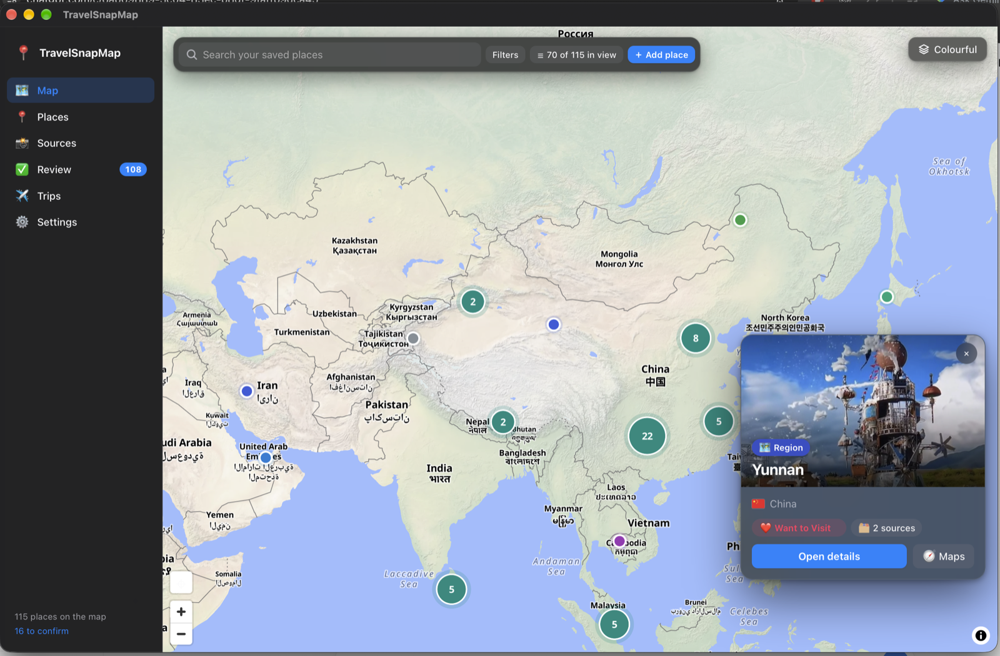

# TravelSnapMap

A macOS app that turns your travel screenshots and saved Instagram Reels into a personal map of places you want to go —
with the tips, prices and opening hours you saved, each linked back to the screenshot or Reel it came from.



Built with Tauri 2, React + TypeScript, Rust + SQLite and a small Swift helper (PhotoKit, Vision, Speech, MapKit).
macOS 15+, local-first.

## Features

- **Screenshots → places.** Scans Apple Photos (or any folder) for new screenshots, reads them on your Mac with Apple
  Vision, and finds the places, tips, prices and hours in them. Clearly unrelated screenshots never leave your Mac.
- **Instagram Reels.** Paste one link, a list, or a text file of links. The audio is transcribed on-device, key frames are
  read, and the places mentioned are added with the exact moment they're mentioned.
- **Map.** Your saved places on a quiet map with category pins and clusters, type-ahead search, filters, a list of the
  places in view (by country, then by city), and a choice of map styles.
- **Place pages.** Every fact shows its source. Different advice from different sources is kept side by side, and
  **Before you go** warns about out-of-date or conflicting info.
- **Trips and memories.** Group places into trips and days. After you've been, add the date, your notes and your own
  photos from Photos (found by location or date).
- **Review inbox** for anything uncertain. **Add Place** for places you know without a screenshot.
- **Backup and export** to a .zip, JSON or GeoJSON.

## Privacy and cost

- Text recognition, speech transcription, image analysis and place matching all run on your Mac.
- DeepSeek receives only the recognised text of likely-travel screenshots and Reels — never images unless you allow it.
- Coordinates always come from Apple Maps, never from the AI.
- Measured cost: about **$0.02–0.04 per 100 screenshots** (deepseek-flash, peak/off-peak pricing shown in Settings).
- Your API key stays in `.env.local` or the macOS Keychain. It is never committed or included in backups.

## Getting started

**Requirements:** macOS 15 or later, Xcode Command Line Tools (`xcode-select --install`), Node.js 20+, Rust
([rustup](https://rustup.rs)). Optional: [yt-dlp](https://github.com/yt-dlp/yt-dlp) for importing Reels by link.

```bash
git clone https://github.com/maninka123/TravelSnapMap.git
cd TravelSnapMap
cp .env.example .env.local     # add your DEEPSEEK_API_KEY
npm install
npm run tauri dev              # or: npm run tauri build
```

Or double-click **`Open TravelSnapMap.command`**: it builds the app when needed and opens it.

On first use macOS asks for Photos access for **TravelSnapMap Photos Bridge** — the small helper that reads your
screenshots.

## Keyboard shortcuts

| Shortcut | Action |
| --- | --- |
| ⌘1 – ⌘6 | Map, Places, Sources, Review, Trips, Settings |
| ⌘F | Search on the current page |
| ↑ ↓ ↩ | Move through and pick search suggestions |

## Development

```bash
npm run build                       # type-check + frontend build
cd src-tauri && cargo test          # Rust tests (pipelines, migrations, backup, pricing, warnings)
```

```text
native/photos-bridge/   Swift helper: PhotoKit, Vision, Speech, MapKit (JSON over stdio)
src-tauri/src/          Rust: pipelines, DeepSeek client, place resolution, SQLite, Tauri commands
src/                    React UI
```

CI runs type-check, build and tests on every push (`.github/workflows/ci.yml`).
