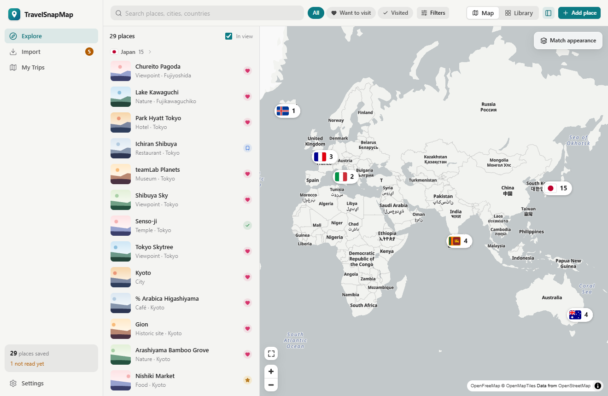

# TravelSnapMap

TravelSnapMap is a local-first macOS app that turns travel screenshots and Instagram Reels into a private, organised
map of places, tips, trips and memories.

It reads your screenshots on your Mac (Apple Vision), understands the travel information with AI, finds the real
places with Apple Maps, and merges everything about the same place. Every tip stays linked to the post it came from.



macOS 15 or later · Tauri 2, React + TypeScript, Rust + SQLite, and a small Swift helper (PhotoKit, Vision, Speech, MapKit).

## What it does

| | |
| --- | --- |
| **Explore** | Your places on a map — countries, then cities, then places — with a list that follows the map, one search for places, cities and countries, kind and status filters (Want to visit, Visited…), and a Library view of every place as cards. The map reopens where you left it. |
| **Import** | Drop screenshots anywhere in the window, scan Apple Photos or a folder, paste Instagram Reel links, or import a video from Photos. Each item is read once — importing it again changes nothing. Live progress, retry for failures, and the estimated AI cost. |
| **Review** | Everything the app wasn't sure about, grouped by reason, each with why it's asking: which place is this, same place twice, is this travel, use this photo, couldn't read. Your answers survive any re-processing. |
| **Places** | Every tip with its source (screenshot, Reel moment, caption), conflicting advice side by side, “Before you go” warnings for out-of-date prices and hours, your notes, your own photos, and corrections: location, merge, split, remove. |
| **My Trips** | Plan trips day by day with drag and drop (or keyboard), a numbered trip map, visited ticks, and a Markdown itinerary export. |
| **Settings** | Appearance (light/dark/match Mac), AI key stored in the macOS Keychain, privacy, sources, cost, backup & restore, diagnostics. |

## Privacy

- Text recognition, speech transcription, photo detection and place matching run on your Mac.
- Screenshots that are clearly unrelated never leave your Mac. DeepSeek receives only the recognised text of likely
  travel posts — never images unless you allow it.
- Coordinates always come from Apple Maps, never from the AI.
- The API key lives in the macOS Keychain and is never written to backups or logs.

## Install

Download the `.dmg` from [Releases](https://github.com/maninka123/TravelSnapMap/releases), drag TravelSnapMap to
Applications, and open it. The welcome guide asks for Photos access and your DeepSeek key. See
[docs/INSTALL.md](docs/INSTALL.md) for troubleshooting and the unsigned-build warning.

## Build from source

Requirements: macOS 15+, Xcode Command Line Tools (`xcode-select --install`), Node.js 20.19+ and Rust
([rustup](https://rustup.rs)). Optional: [yt-dlp](https://github.com/yt-dlp/yt-dlp) for Reel videos.

```bash
git clone https://github.com/maninka123/TravelSnapMap.git
cd TravelSnapMap
npm install
npm run tauri dev        # run the app
npm run tauri build      # build TravelSnapMap.app and the .dmg
```

Or double-click `scripts/open-app.command`, which builds the app when needed and opens it.

## Development

```bash
npm run typecheck        # TypeScript
npm test                 # UI tests (Vitest + Testing Library, against an in-memory demo backend)
npm run demo             # the UI in a browser with a sample library (no Mac APIs needed)
npm run test:rust        # Rust: pipeline, migrations, backup/restore, corrections, accuracy gates
```

```text
src/                     React UI — app shell, features/ (explore, import, review, places, trips, settings, onboarding)
src-tauri/src/           Rust — pipelines, AI client, place matching, SQLite, Tauri commands
src-tauri/eval/          Labelled evaluation data (travel filter, place matching, duplicates)
native/photos-bridge/    Swift helper — PhotoKit, Vision, Speech, MapKit (JSON over stdio)
scripts/                 Build helpers and the double-click launcher
docs/                    Architecture, install, releasing, evaluation, release notes, screenshots
```

More: [Architecture](docs/ARCHITECTURE.md) · [Evaluation](docs/EVALUATION.md) · [Releasing](docs/RELEASING.md) ·
[Release notes](docs/RELEASE_NOTES.md) · [Development log](docs/DEVELOPMENT_LOG.md)
